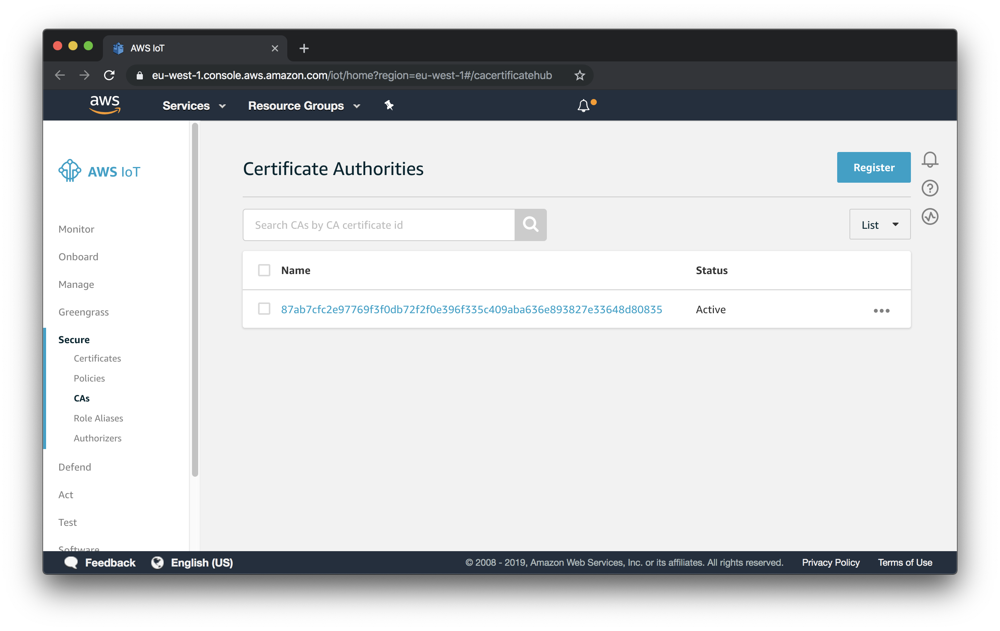
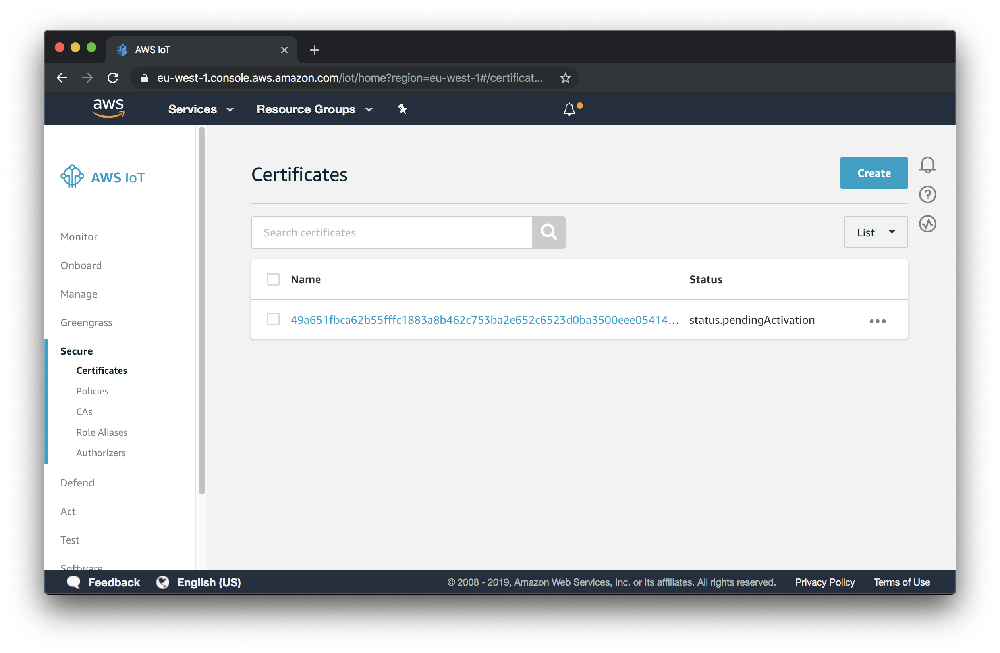

<br />
<p align="center">
  
</p>

# aws-iot-certificate-generator
> A X.509 Root CA and device certificate generator for use with AWS IoT Just-In-Time-Registration.

[](https://deepsource.io/gh/HQarroum/aws-iot-certificate-generator/?ref=repository-badge)

Current version: **1.0.0**

## 📋 Table of content

- [Installation](#-install)
- [Pre-requisites](#-pre-requisites)
- [Metrics](#-metrics)
- [Description](#-description)
- [Command-line tools](#-command-line-tools)
- [See also](#-see-also)

## 🎒 Pre-requisites

A few components are required as dependencies to this project before using the scripts it contains :

- A UNIX environment such as MacOS or Linux.
- The [openssl](https://wiki.openssl.org/index.php/Command_Line_Utilities) command-line tools should be installed on your operating system.
- The [AWS CLI](https://aws.amazon.com/fr/cli/) must be installed and configured with at least one account.
- The [mosquitto_pub](https://mosquitto.org/man/mosquitto_pub-1.html) command-line tools to test your generated certificates.

## 🔰 Description

This project can help you understand the creation of a custom certificate authority (CA) and device certificates required as part of the [Just In Time Registration (JITR)](https://aws.amazon.com/fr/blogs/iot/just-in-time-registration-of-device-certificates-on-aws-iot/) process and will assist you in performing yourself the following tasks on your AWS account :

- Creating your own custom [Root Certificate of Authority (Root CA)](https://en.wikipedia.org/wiki/Root_certificate).
- Registering your Root CA on AWS IoT.
- Creating devices certificates offline and connecting using those certificates to AWS IoT.
- Modifying the attributes of your device certificates.

## 📟 Command-line tools

This project features a few command-line tools in the `bin` directory that will help you create a new CA, device certificates, and connect to AWS IoT with the generated certificates :

- [`create-and-register-ca.sh`](bin/create-and-register-ca.sh) starts the process of creating an X.509 Root Certificate of Authority and will register the newly created Root CA on AWS IoT, activate it, and enable its auto registration status.
- [`create-device-certificate.sh`](bin/create-device-certificate.sh) uses a previously created Root Certificate of Authority to sign a new device certificate which is ready to be provisionned on a device.
- [`connect-device.sh`](bin/connect-device.sh) uses a the created device certificate to connect to AWS IoT and publish a message on a topic.

### Creating a new CA

Head using your terminal to the [`bin`](./bin/) directory which contains the bash scripts we will be using. Next, create a new CA by invoking the `create-and-register-ca.sh` script.

```bash
# Make the script executable.
chmod +x create-and-register-ca.sh
# Create a new Root CA.
./create-and-register-ca.sh
```

> You will be prompted to confirm whether you want to register the newly created Root CA on your account using the AWS CLI, confirm the prompt.

Head to the [AWS IoT CA console](https://console.aws.amazon.com/iot/home#/cacertificatehub) in your browser and confirm that the new CA has been registered.

<p align="center">
  
</p>

### Connecting your first Thing

The next step is to create a new device certificate signed using the newly created CA. This certificate will be created totally offline without requiring Internet or AWS access. To do so, invoke the `create-device-certificate.sh` script.

```bash
# Make the script executable.
chmod +x create-device-certificate.sh
# Create a new device certificate.
./create-device-certificate.sh
```

If the script was successful, you should see the newly created device certificate files in the device-certs directory. Once you are all set up, you will need to try an MQTT connection to your AWS IoT Core endpoint using the new device certificate.
This is where the [mosquitto_pub](https://mosquitto.org/man/mosquitto_pub-1.html) command-line tool will be necessary.

The below command will pick-up the generated device certificate and connect to AWS IoT.

```bash
# Make the script executable.
chmod +x connect-device.sh
# Create a new device certificate.
./connect-device.sh
```

After having executed this command, it will fail with an error indicating that the Connection was lost. This is because the certificate associated with the device is not yet activated on the AWS IoT platform. If you go to the certificate console, you will see a new certificate entry that was automatically added by AWS IoT upon the connection of the device.

<p align="center">
  
</p>

The AWS IoT platform automatically adds a device certificate signed by a registered custom CA in the `status.pendingActivation` state when the device connects for the first time. You will have to activate the certificate and attach to it a policy allowing the bash script to publish a message on the `${thing-name}/telemetry` topic.

## 👀 See Also

- The [Just In Time Registration (JITR)](https://aws.amazon.com/fr/blogs/iot/just-in-time-registration-of-device-certificates-on-aws-iot/) blog post.